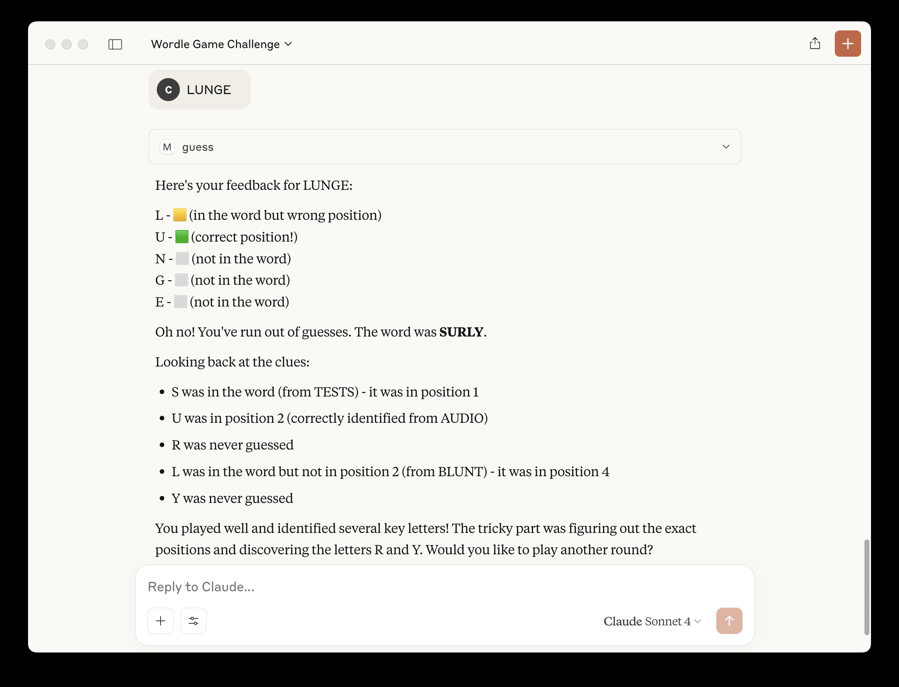

# MCP Wordle Server

A Model Context Protocol (MCP) server implementation of the Wordle game that can be played through AI assistants like Claude.

## About

This project implements a Wordle game server that follows the Model Context Protocol, allowing AI assistants to play the classic word guessing game. Players have 6 attempts to guess a 5-letter word, with feedback provided for each guess.

Letter feedback is provided as:
- `MATCH` - Correct letter in correct position (green)
- `PARTIAL_MATCH` - Correct letter in wrong position (yellow)  
- `MISS` - Letter not in word (grey)


## Installation

### Claude

You can install this server in Claude Desktop and interact with it right away by running:

```
mcp install server.py
```

### Github Copilot

First, [install uv](https://docs.astral.sh/uv/#installation). Then, add the following to your MCP config:

```
"mcp-wordle": {
    "command": "uv",
    "args": [
        "run",
        "--with",
        "mcp[cli]",
        "mcp",
        "run",
        "<path_to_repo>/mcp-wordle/server.py"
    ]
}
```

## Playing the game

### Starting a game


### Guessing a word


### Win scenario


### Lose scenario

